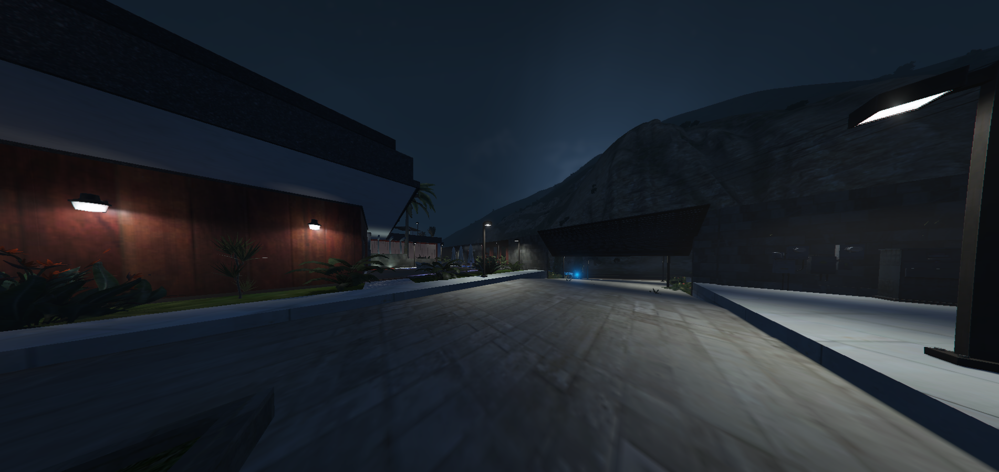

# PhoenixMansion Ymap MLO for FiveM

## Description

The PhoenixMansion is a meticulously designed Mafia-styled mansion, built using Ymap MLO for FiveM. It offers a luxurious and immersive experience for roleplay or other server activities in Grand Theft Auto V (GTA V).

## Features

- Detailed and immersive interior design.
- Suitable for Mafia-themed roleplay or as a high-end player housing option.
- Multiple rooms and areas for diverse in-game activities.
- High-quality textures and custom props.
- Compatible with popular FiveM resources and scripts.

## Installation

1. Download the latest release from this repo.
2. Extract the downloaded ZIP file.
3. Place the `PhoenixNansion` folder in your FiveM server's resources directory.
4. Add `ensure PhoenixNansion` to your server.cfg to ensure the resource is started when your server boots.

## Usage

1. Join your FiveM server.
2. Use a trainer or in-game commands to teleport to the PhoenixMansion location.
3. Explore and enjoy the luxurious interior.

## Additional Notes

- Make sure to follow all server rules and guidelines while using this resource.
- Please report any bugs or glitches to us for improvement.

## Screnshots

